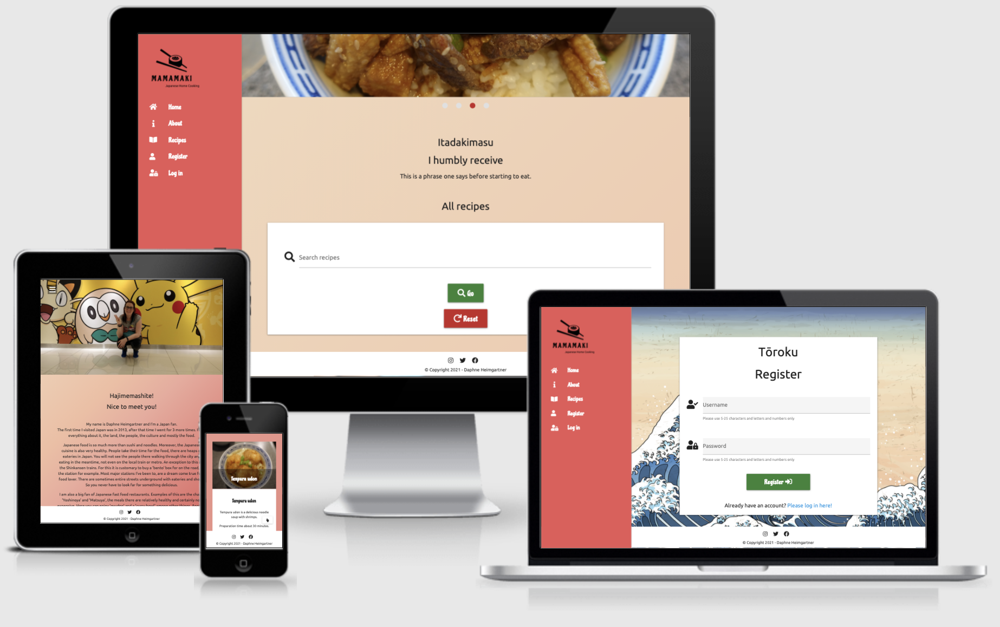

MAMAMAKI
======

**[Code Institute](https://codeinstitute.net/)  Milestone Project 3: Python and Data Centric Development**


MAMAMAKI is a site for Japanese home cooking recipes and when you are logged in, you can add, edit and delete your own recipes.
The focus with this site is to combine knowledge about Japanese home cooking with what was learned this far about HTML, CSS, JavaScript and Python. The site’s goal is to share recipes.

:clapper: Demo
======

Due to changes on Heroku, there is no longer a demo link available.




<div align="right"><a href="#top">🔝</a></div>

:open_file_folder: Table of Contents
======

**<details><summary>UX</summary>**
* [**_User stories_**](#user-stories)
    * [_Strategy_](#strategy)
    * [_Scope_](#scope)
    * [_Structure_](#structure)
    * [_Skeleton_](#skeleton)
</details>

**<details><summary>Features</summary>**
* [**_Existing Features_**](#existing-features)
* [**_Features for the future_**](#features-for-the-future)
</details>

**<details><summary>Technologies</summary>**
* [**_Languages_**](#languages)
* [**_Libraries and frameworks_**](#libraries-and-frameworks)
* [**_Wireframes_**](#wireframes)
* [**_Tools_**](#tools)
</details>

**<details><summary>Testing and Bugs</summary>**
* [**_Testing file_**](#testing-file)
</details>

**<details><summary>Deployment</summary>**
* [**_Deployment_**](#deployment)
</details>

**<details><summary>Credits</summary>**
* [**_Content_**](#content)
* [**_Code_**](#code)
* [**_Media_**](#media)
* [**_Other_**](#other)
* [**_Acknowledgements_**](#acknowledgements)
</details>
<br>
<div align="right"><a href="#top">🔝</a></div>

:busts_in_silhouette: UX
======

This is meant to be a B2C site which targets visitors who are interested in Japanese home cooking.

### User stories

##### Visitor Goals

- To be able to see different recipes and search for them using keywords.
- To create an account and log in on that account.
- To create, read, update and delete my own recipes.

##### Site Owners Goals

- To share the love for Japanese home cooking and promote it.
- Share nice Japanese home cooking recipes.

### Strategy

The design goal is to make a clear, accessible, structured site so that visitors can easily see the recipes, navigate on the site and add, edit and delete their own recipes.

### Scope

The site shows a homepage with a small introduction. Second is the about page which tells a bit about the creator of the site and why the site was created. Furthermore, the site contains a recipes page on which you can you choose to go to a specific recipe. It also contains a register page, a log in page, a personal recipe page and a add recipe page.
The personal recipe page, add recipe page and the log out option will only be visible when you are logged in.
| Sidenav | Logged in User | Logged out User |
 --- | --- | ---
Home| &#9989; | &#9989; |
About |&#9989; | &#9989; |
Recipes|&#9989; | &#9989; |
Register| &#10060; | &#9989; |
Log in| &#10060; | &#9989; |
Personal recipe page| &#9989; | &#10060; |
Add recipe| &#9989; | &#10060; |
Log out| &#9989; | &#10060; |

Also on the homepage there is a difference in what you will see when you are logged in or logged out.

| Homepage | Logged in User | Logged out User |
 --- | --- | ---
Register button | &#10060; | &#9989; |
Log in button  | &#10060; | &#9989; |

A difference has also been made in user rights:
| Recipe options | Standard User Account | Admin User Account |
 --- | --- | ---
Add own recipe| &#9989; | &#9989; |
Edit own recipe | &#9989; | &#9989; |
Delete own recipe | &#9989; | &#9989; |
Edit recipes of other users| &#10060; | &#9989; |
Delete recipes of other users| &#10060; | &#9989; |

### Structure

The site will be structured as clear as possible, it should be easy to see what you can do on the page, on all screen sizes it should be clear what you can do on each part of the site. 

### Skeleton

The skeleton section is a bit more extensive, for that reason please view this separate [file](skeleton/README.md).
<div align="right"><a href="#top">🔝</a></div>

### Fonts and icons

[Google Fonts](https://fonts.google.com/) was used to embed the Chicle and Ubuntu font in the code. Chicle was chosen because this reminds of Japanese calligraphy. Ubuntu was chosen because for the main text I felt this has a better readability which gives better UX.

For the icons [Font Awesome](https://fontawesome.com/) was used.
<div align="right"><a href="#top">🔝</a></div>

:star2: Features
======

### Existing Features

The site contains the following features: 

- See an overview of multiple recipes.
- Select a specific recipe and see the details of that recipe.
- Have clear and easy to use page navigation.
- Register an account.
- Log in to that account and log out of it.
- Add, edit and delete your own recipes.

### Features for the future 

The following items can be added: 

- Comment on other people’s recipes.
- Being able to share a recipe on social media.
- Being able to print out a recipe directly from the site with one click on a button. 
- Put the ingredients on a shopping list which one can print out.
- Share videos of the cooking techniques.
<div align="right"><a href="#top">🔝</a></div>

:gear: Technologies
======

### Languages

- HTML
- CSS
- Python
- JavaScript

### Libraries and Frameworks

- Materialize 1.0.0
- jQuery
- PyMongo
- Flask
- Jinja
- Werkzeug

### Wireframes

- [Adobe XD](https://www.adobe.com/products/xd.html)

### Tools

- [Adobe Photoshop](https://www.adobe.com/products/photoshop.html): to resize the images.
- [tinypng](https://tinypng.com/): was used to downsize the images.
- [Cloudinary](https://cloudinary.com/): was used to store the images and get an URL-link for them which are used in my recipes.
- [Adobe Illustrator](https://www.adobe.com/products/illustrator.html): to create the logo.
- [VSCode](https://code.visualstudio.com/): to write the code in.
- [EmailJS](https://www.emailjs.com/): for receiving the content of the contact form
- [MongoDB Atlas](https://www.mongodb.com/): as a database for this project
- [Heroku](https://www.heroku.com/): as a host for the deployed site
- [GitHub](https://github.com/): for the repository
<div align="right"><a href="#top">🔝</a></div>

:test_tube: :bug: Testing and Bugs 
======

### Testing file

The tests have been done on multiple devices and browsers. In the end everything works as intended. Because this topic contained more content than expected, a separate page was created.
For more details about testing and bugs please view this [file](testing/README.md).
<div align="right"><a href="#top">🔝</a></div>

:computer: Deployment
======

### Deployment

The deployment section is a bit more extensive for that reason please view this separate [file](deployment/README.md).
<div align="right"><a href="#top">🔝</a></div>

:copyright: Credits
======

### Content
All content has been written by me, but the original recipes come out of two books and two websites which are:

1. [Tori to piman no itame ni - Japans Koken - Harumi Kurihara](https://www.yutori.co.jp/en/index.html) 
2. [Tamago - SUSHITOTAAL.NL](https://www.sushitotaal.nl/tamago_bereiden) 
3. [Miso soup - THE SUSHI TIMES](https://www.thesushitimes.com/recept-miso-soep-onmisbaar-japanse-keuken/) 
4. [All the other recipes - Culinair genieten - Japans](https://www.lantaarnpublishers.nl/winkel/koken/japans/) 

The recipes added by users `admin` and `daphnehf` are all cooked and photographed by me.
I have sometimes edited these recipes to my own liking while cooking, the edited versions are on the site.
Recipes posted by other users are not pre-tested!

### Code:

1. [Code Institute LMS Backend Development Task Manager Miniproject by Tim Nelson](https://learn.codeinstitute.net/courses/course-v1:CodeInstitute+DCP101+2017_T3/courseware/9e2f12f5584e48acb3c29e9b0d7cc4fe/054c3813e82e4195b5a4d8cd8a99ebaa/) this was used as the basis of the code and then modified to make it my own site.
2. [CSS Gradient](https://cssgradient.io/gradient-backgrounds/) to create the gradient background with CSS.
3. [Stack Overflow](https://stackoverflow.com/questions/16841323/making-gradient-background-fill-page-with-css/16841457) to prevent the gradient background from repeating and without having to use a fixed height value with px.
4. [Sanwebe.com](https://www.sanwebe.com/2013/03/addremove-input-fields-dynamically-with-jquery) as help to let jQuery add and remove extra fields for the ingredients list and the instruction list.
5. [Stack Overflow](https://stackoverflow.com/questions/20233721/how-do-you-index-on-a-jinja-template) to help me figure out how to loop over the ingredients list and the instruction list and get them displayed.
6. [W3schools](https://www.w3schools.com/howto/howto_js_collapsible.asp) to help me make a collapsible with HTML and JavaScript.
7. [W3schools](https://www.w3schools.com/howto/howto_js_scroll_to_top.asp) to help me make a scroll back to the top button.
8. [Autoprefixer CSS](https://autoprefixer.github.io/) to optimize the use of vendor extensions in the CSS code.
9. [Materialize](https://materializecss.com/) as a reference work on the framework.
10. [Python Programming](https://pythonprogramming.net/decorator-wrappers-flask-tutorial-login-required/) as how to use the Login_Required decorator.
<div align="right"><a href="#top">🔝</a></div>

### Media 

#### Images:

1. [MCICON](https://www.mcicon.com/product/sushi-icon-3/) for the sushi icon in the logo.

2. [Adobe Stock](https://stock.adobe.com/nl/images/wave-tides-in-ukiyo-e-style/229859488) the wave image is a licensed image downloaded with a paid Adobe Stock account, the image was used for the background of the register and log in page.

3. Photos of the food, for recipes added by users "admin" and "daphnehf", all these photos are my own.

4. [Color-hex](https://www.color-hex.com/) was used to get the images of the colors that were used.

5. [favicon.io](https://favicon.io/emoji-favicons/sushi/) was used to get an existing favicon for the site.

6. [Rawpixel](https://www.rawpixel.com/image/2400897/free-illustration-png-japan-japanese-culture-art-torii-gate) Japanese torii gate sticker with white border by Tvzsu was used as a background for the error pages.

### Other

1. [creately](https://creately.com/) to create the data diagrams.
2. [RandomKeygen](https://randomkeygen.com/) to get a value for the secret key.
3. [cdnjs](https://cdnjs.com/) to get the fontawesome cdn from.
4. [jQuery](https://code.jquery.com/) to get the jQuery cdn from.
5. [Am I Responsive?](http://ami.responsivedesign.is/) to check the responsiveness and make the mockups.
6. [WebAIM](https://webaim.org/resources/contrastchecker/) used for checking contrasts on the site.

### Acknowledgements

- My mentor from Code Institute, thank you Narender for your time and guidance.
- My husband, thank you Django for taking more care of our son so I can work on my education, thank you for trying my cooking skills with these recipes and thank you for your patience.
- Fellow student, Abi Harrison, for sharing her info about good head elements.
- Fellow student, Sean McMahon, in who's Readme file I saw the idea to make a collapsible table of contents.
- Fellow student, Kotaro Tanaka, in who's Readme file I saw the idea to make it possible to go back of the top of a page.
- Fellow student, Benjamin Kavanagh, for looking into my code and remind me to use also the url_for also my images to prevent them from giving a 404.
```
{{ url_for('static', filename='images/logo.png') }}
```
- Fellow students / slack members, Andrew Dempsey, Mike Avgeros and Peter Baker for extensively testing my project.
- Special thanks to my colleagues, friends and family for their support, tips and for testing my project.
<div align="right"><a href="#top">🔝</a></div>
