:open_file_folder: Table of Contents
======

**<details><summary>Deployment</summary>**
* [**_Live version_**](#live-version)
* [**_Run local_**](#run-local)
* [**_Heroku_**](#heroku)
* [**_Setting EmailJS up_**](#setting-emailjs-up)
</details>
<br>

:computer: Deployment
======

### Live version

To view the deployed version, the steps underneath can be followed:

1. Go to [GitHub](https://github.com/)
2. Find Daph1986's [page](https://github.com/Daph1986)
3. Select repositories.
4. Select the mamamaki repository.
5. Click on the link on the right side or on the link under `Demo`.
By clicking that link the live demo version will be visible. <br>

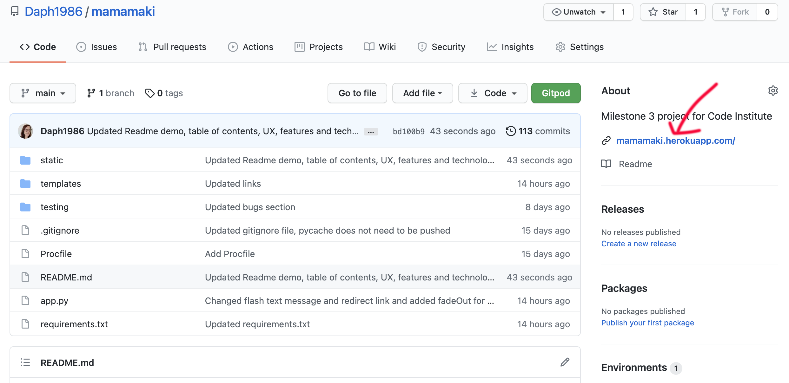
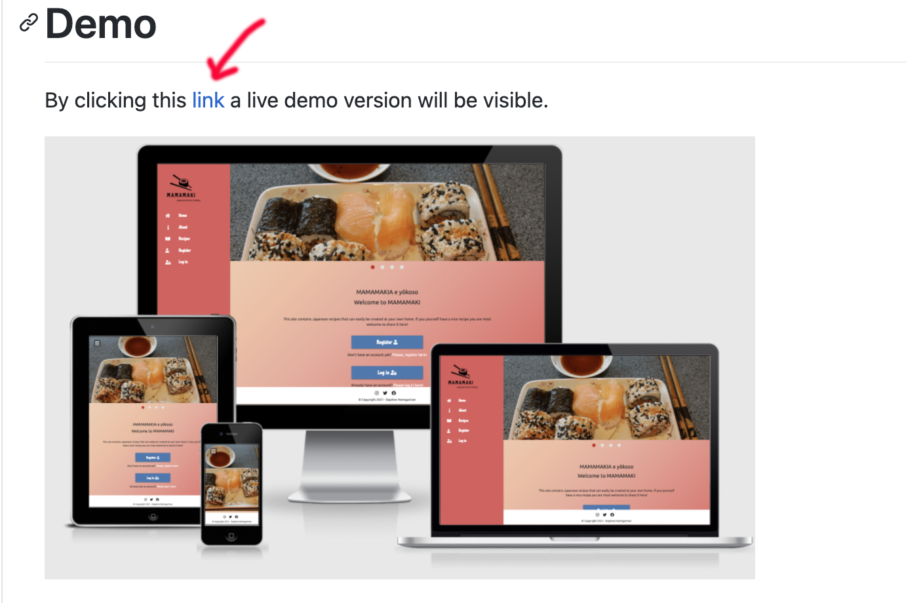
<div align="right"><a href="#top">🔝</a></div>

### Run local

If you would like to run this website locally you can clone this repository in an IDE such as VSCode. Make sure that `PIP3`, `Flask`, `Python3` and `Git` are installed. Set up your account for [MongoDB Atlas](https://www.mongodb.com/cloud/atlas), how to do that you can see [here](https://docs.atlas.mongodb.com/).
You can clone it by following the next steps: <br>

1. Log in at [GitHub](https://github.com/) 
2. Find Daph1986's [page](https://github.com/Daph1986)
3. Select repositories.
4. Select the `mamamaki` repository.
5. Click on the `Code` button. <br>
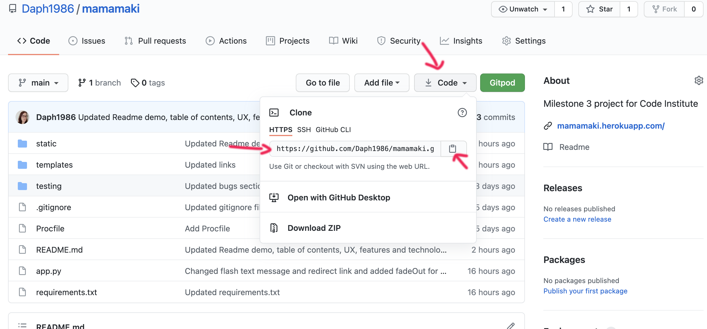 <br>

6. Copy the URL.
7. Open VScode or your preferred IDE, open the file or folder in which you want to use the project and open a CLI terminal.
8. Put the following command in the CLI terminal:

``` 
git clone https://github.com/Daph1986/mamamaki.git
``` 

9. Press enter, and the clone will be created.
10. Create a new `Cluster` and a new `Database` in your MongoDB account.
In this case the database is called `mamamaki_recipe_manager`, two collections are used:<br>
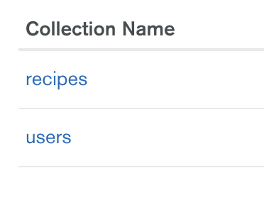 <br> 
and they are filled out like this:<br> 
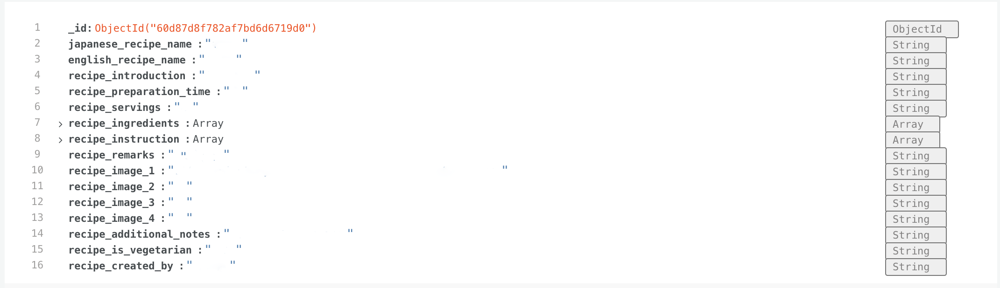
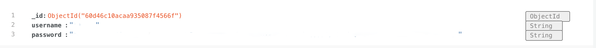

11. Create an `env.py` file, type
```
touch env.py
```
in the CLI terminal, use this file for storing your variables. It should contain this:
```
import os

os.environ.setdefault("IP", "value")
os.environ.setdefault("PORT", "value")
os.environ.setdefault("SECRET_KEY", "value")
os.environ.setdefault("MONGO_URI", "value")
os.environ.setdefault("MONGO_DBNAME", "value")
```
For `IP` you can use `0.0.0.0`, for `PORT` you can use `5000` for `SECRET_KEY` you can make up your own password or use [RandomKeygen](https://randomkeygen.com/) to generate a password. The `MONGO_URI` and `MONGO_DBNAME` values you can find in your MongoDB account.
Your `MONGO_DBNAME` is here:<br>
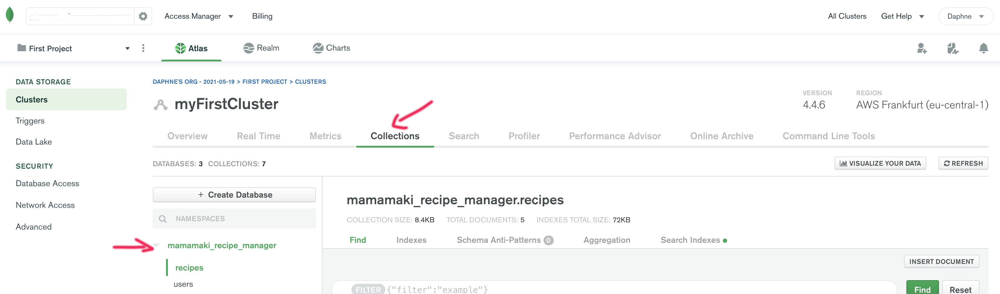 <br>
The `MONGO_URI` you'll find when you click `Clusters` and then `Connect`.
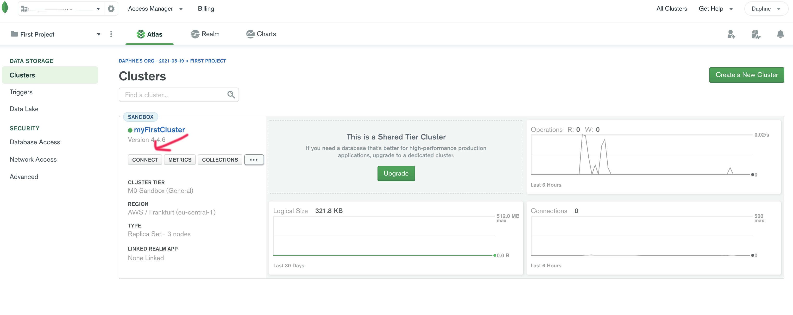 <br>
Choose the option in the middle<br>
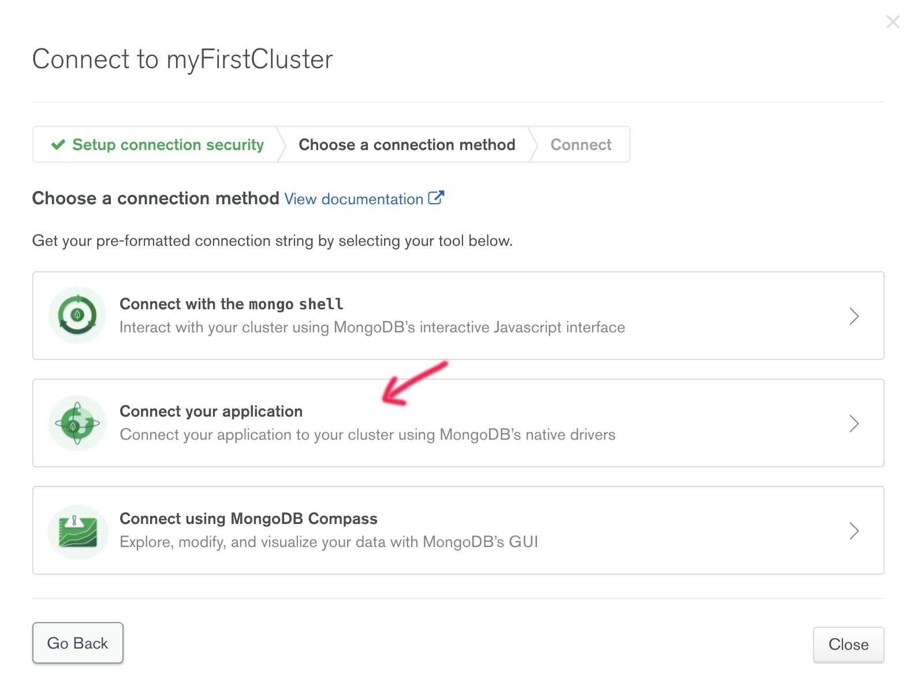 <br>
Set it to `Python` and version `3.6 or later`. Copy the code you see here:<br>
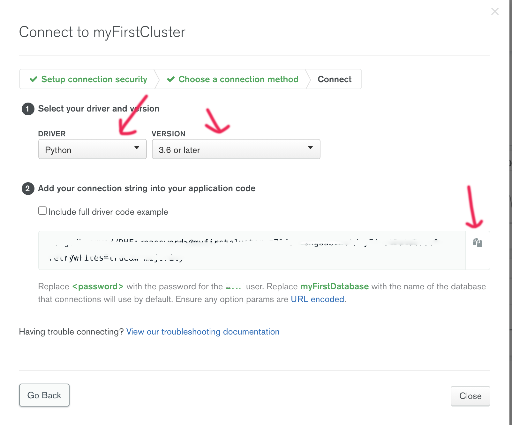 <br>
Replace the password with your own and replace the database name for your own.
For more information about MongoDB Atlas, you can look [here](https://docs.atlas.mongodb.com/).

12. Create a `.gitignore` file type
```
touch .gitignore
```
in the CLI terminal, this file is to make sure that the variables of the `env.py` are not being published. It should contain:
```
env.py
__pycache__/

```
13. You can now run the app by tying:
```
python3 app.py
```
in the CLI terminal. It will show ` * Running on http://192.168.1.170:5000/ (Press CTRL+C to quit)` in the terminal, you can visit the website by pressing the link holding the CTRL or COMMAND button, depending on if you are using a Windows or IOS system.
<div align="right"><a href="#top">🔝</a></div>

### Heroku

To create a live version of the website VSCode was used together with Heroku.
To deploy the website with Heroku the following steps were made:

1. Create a `requirement.txt` and `Procfile` file by typing `pip3 freeze --local > requirements.txt` and then `echo web: python app.py >Procfile` in the CLI terminal.
2. Make sure that these files are committed, added and pushed to your GitHub repository.
3. Log in or create an account on [Heroku](https://www.heroku.com) and create a new app by clicking the button.<br>
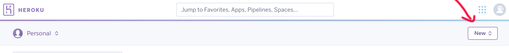

4. Give the app a name in all lowercase letters and set `Choose a region` to Europe, click on create app.<br>
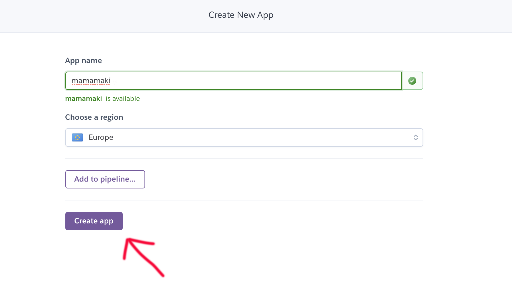

5. On your app dashboard click deploy and select `GitHub`, connect it to your GitHub respository. Don't click `Enable Automatic Deploys` yet. <br>
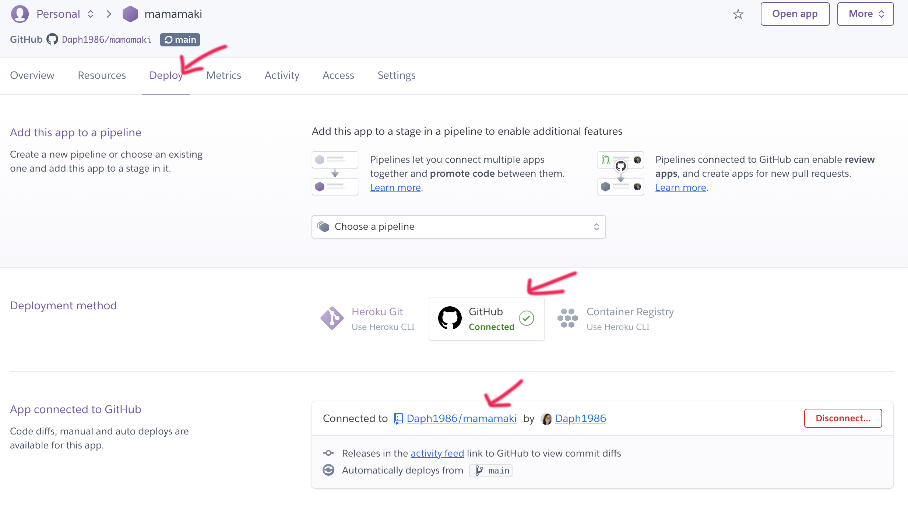

6. Click on `Settings` and then `Reveal Config Vars`. <br>
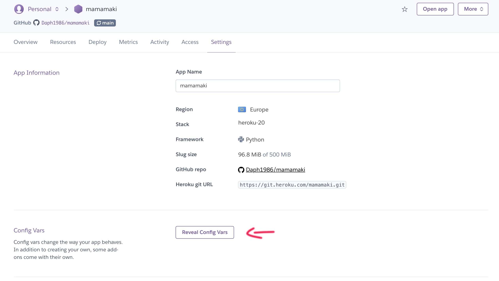

7. Fill in the vars with your own username, password, database name and secretkey which you have in your `env.py` file: <br>

| Key | Value |
 --- | ---
IP | 0.0.0.0
MONGO_DBNAME | `<your_mongodb_database_name>`
MONGO_URI | `mongodb+srv://<username>:<password>@myfirstcluster.z7l4s.mongodb.net/<database_name>?retryWrites=true&w=majority`
PORT | 5000
SECRET_KEY | `<your_secret_key>`

For more information about your MONGO_URI in MongoDB Atlas you can look [here](https://docs.atlas.mongodb.com/).
<br>

8. Now click on `Enable Automatic Deploys` and then `Deploy Branch`
9. This can take a little bit, when it's ready you should see something like this:<br>
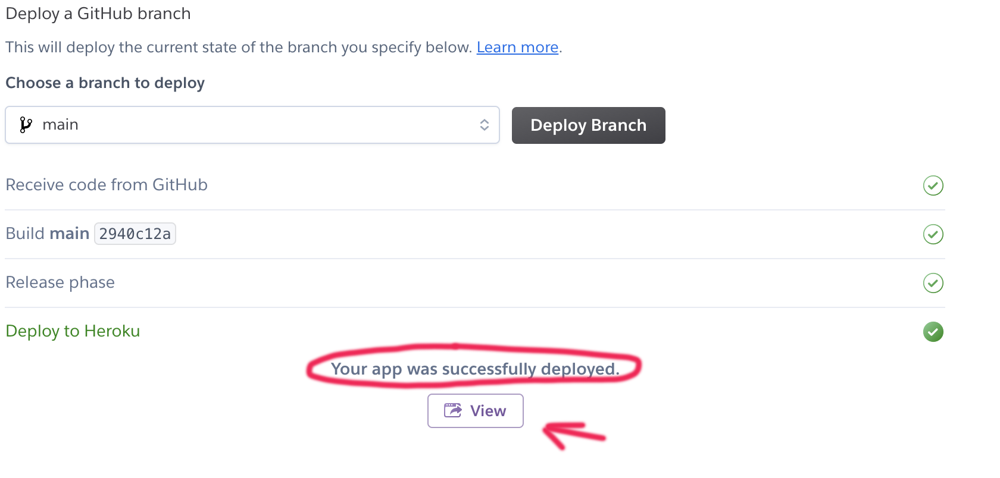
You can click the view button to launch your app.
<div align="right"><a href="#top">🔝</a></div>

### Setting EmailJS up

1. Go to [EmailJS](https://www.emailjs.com/) sign into your existing account or sign up to create an account.
2. Click on `Email Services` and then `Add New Service`. <br>
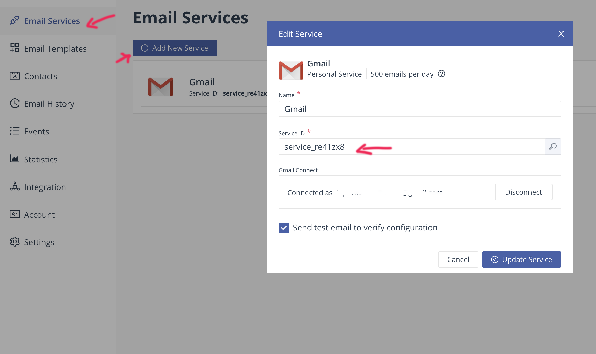
3. Save and click on `Email Templates`. <br>
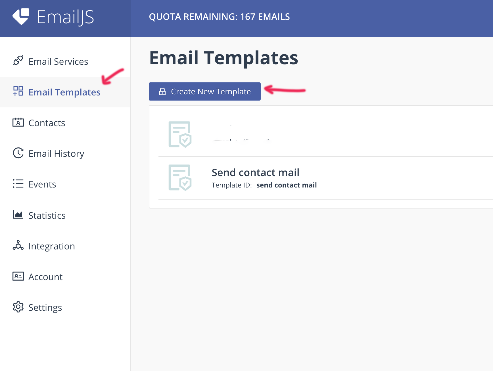
4. Make a template and give it the id names of `send contact mail` to ensure they work with the function in this code. <br>
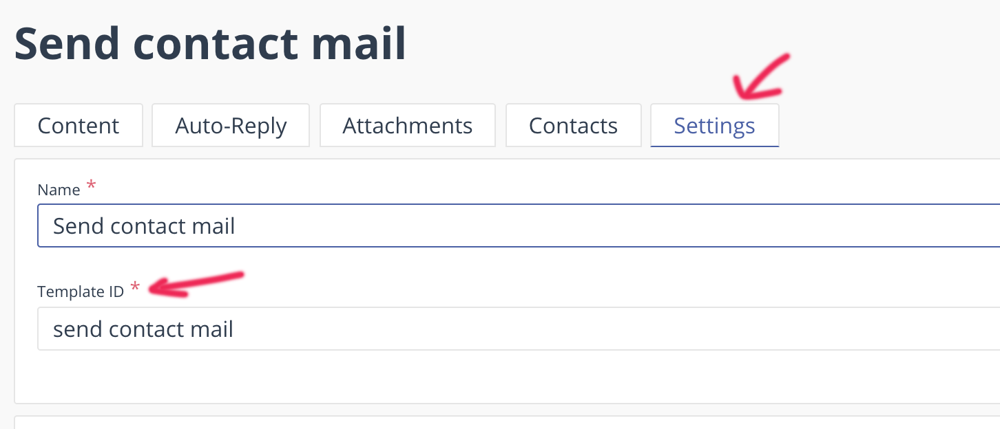
5. Copy the service id as shown at step 2.<br>
6. Replace the id in the code for your own id. <br>
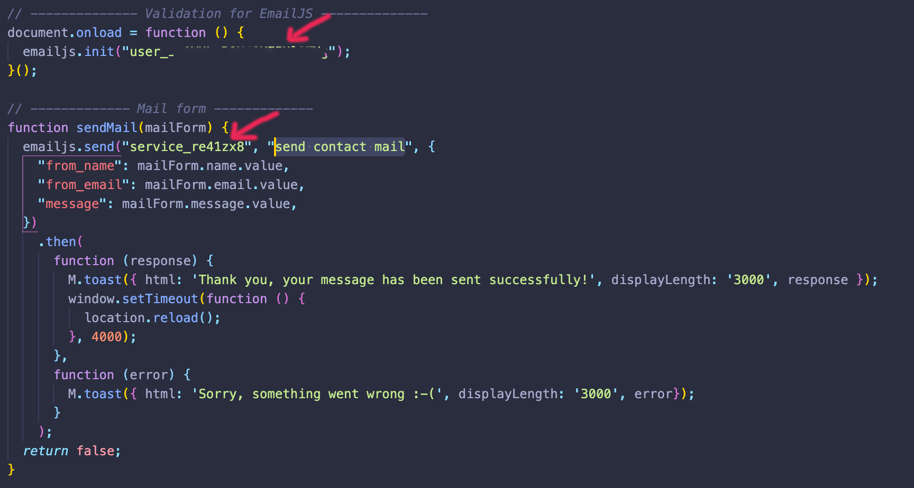
7. Go to `Integration` and copy the user id and replace your id for the id in the JavaScript file.<br>
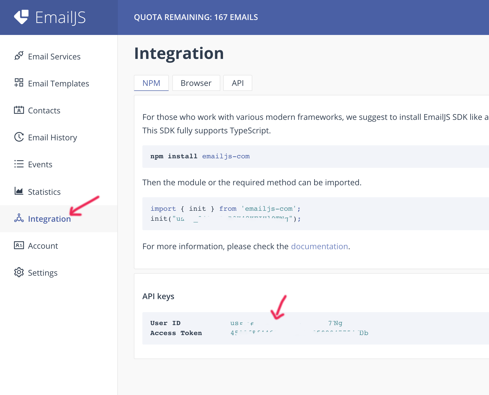
8. The EmailJS service is set up and everything should work.
<div align="right"><a href="#top">🔝</a></div>