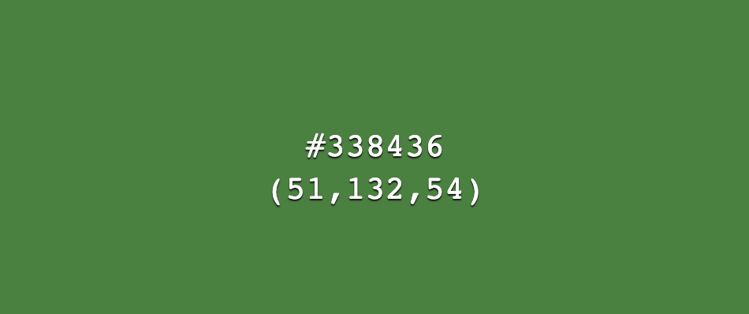

### Skeleton

Desktop wireframes  

Tablet wireframes  

Mobile wireframes 

Raw data diagram 

 
Eventually some items were added to the diagram and it has been simplified.

<a href="#top">🔝</a>

**Surface**

The following main colors have been used:

    

For the buttons and forms the following colors have been used:

    
   
   

For a gradient background:  
    

Which results in this:  
  
For this [CSS Gradient](https://cssgradient.io/gradient-backgrounds/) was used.

The colors were chosen because they fit very well with Japan, reminding of Sakura blossoms. The [background](https://stock.adobe.com/nl/images/wave-tides-in-ukiyo-e-style/229859488) of the sea, is a reference to a traditional Japanese painting, called “The Great Wave off Kanagawa”.  
  

This was chosen because it gives a nice separation to the register and log in page from the rest of the site and I think it connects well with the recipes, because a few of them use fish as an ingredient. And fish comes from the sea.

The first set up for the wireframes was with a grey background and footer, but it was felt to be UX unappealing, that’s why this was changed to the current wireframes.

During development the site's layout was restructured a little bit, because this seemed visually or otherwise better.
They are listed below, the more extensive ones, with a link to the issue item where they are further explained.

1. [Headers](https://github.com/Daph1986/mamamaki/issues/22) on register and login page
2. [Text alignment](https://github.com/Daph1986/mamamaki/issues/23)
3. Two call to action buttons have been added to the homepage to make it more user-friendly and to register or log in right away. A contact form has also been added, again to increase user-friendliness.
4. A scroll to the top button has been added on all pages, so you don't have to scroll all the way up again, this improves user-friendliness. They will appear automatically as soon as you have to scroll down.
5. On the about page the words `register page` have been linked to go directly to that page.
6. On the single recipe page, the ingredients list and the instruction list have been made collapsible to make it easier during cooking, when you have the ingredients ready, just close it and keep only the instruction list open. Because not all the recipes show the calories, it has been decided to omit that and instead put down which user has added the recipe.
7. Some additional text has been added to the personal recipe page to indicate what it displays, and the white block was removed, the content is merged with the header.
8. Some extra fields have been added to the add recipe page, namely `remarks`, `additional notes` and a switch for if it's a `vegetarian` recipe.
9. Initially the color of the sidenav was #df5b5b but this has been changed to #ea5757 to ensure that even when a page has a lot of content there is always a color difference between the sidenav and the background.