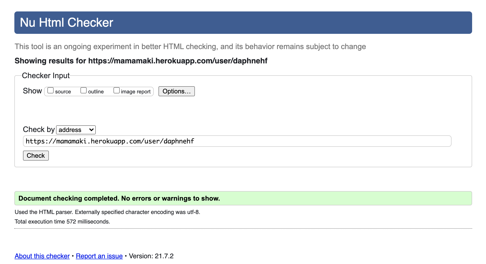
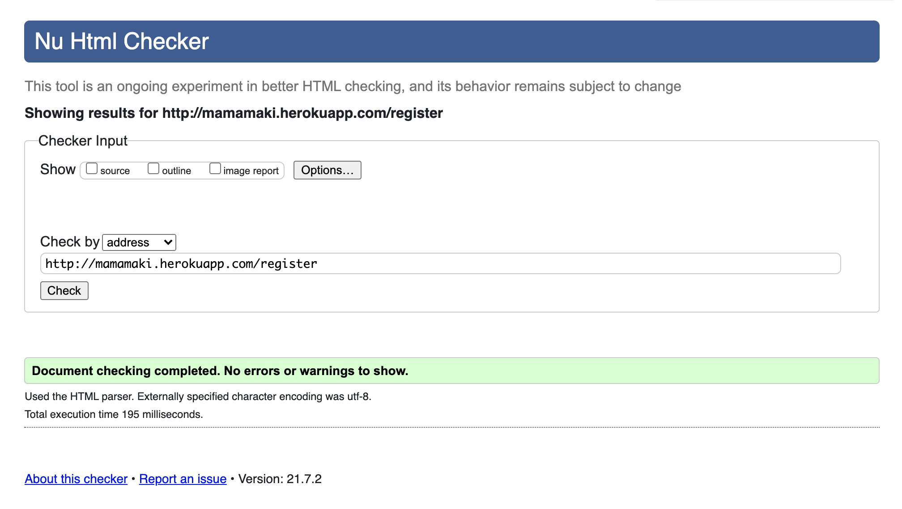
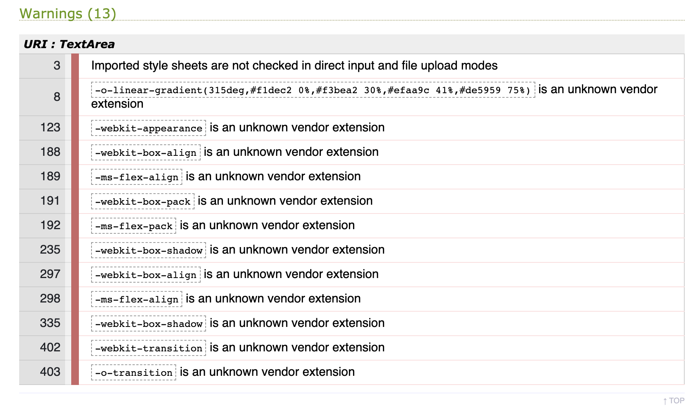
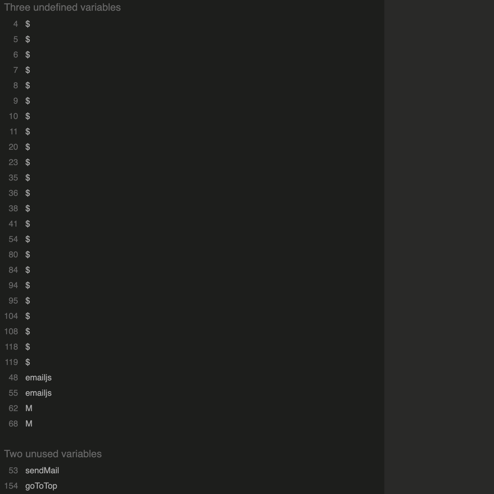

:open_file_folder: Table of Contents
======

**

Manual testing
**
* [**_User stories_**](#user-stories)

**

Code check
**
* [**_HTML_**](#html)
* [**_CSS_**](#css)
* [**_JavaScript_**](#javascript)
* [**_Python_**](#python)
* [**_Lighthouse_**](#lighthouse)
* [**_GTmetrix_**](#gtmetrix)
* [**_Color blindness_**](#color-blindness)
* [**_Other tests_**](#other-tests)

**

Bugs
**
* [**_Background_**](#background)
* [**_Mobile nav_**](#mobile-nav)
* [**_Flash messages_**](#flash-messages)
* [**_Logo in sidenav_**](#logo-in-sidenav)
* [**_Safari button bug_**](#safari-button-bug)
* [**_Multiple cards in one card bug_**](#multiple-cards-in-one-card-bug)

<a href="#top">🔝</a>

:construction_worker_woman: :construction_worker_man: Manual testing
======

### User stories

The design goal is to make a clear, accessible, structured site so that visitors can easily read the displayed recipes, make an account and add, edit and delete their own recipes.  
<!-- The visitor goals are:
- To be able to see different recipes and search for them using keywords.

- To create an account and log in on that account.

- To create, read, update and delete my own recipes.

The site owners goals are:
- To share the love for Japanese home cooking and promote it.
- Share nice Japanese home cooking recipes.

It can be concluded that all goals have been achieved.   -->

The project has been tested on the available DevTools for phone and tablet sizes as well as on multiple responsive sizes and it was made sure that it looks good and works well on all. It was also tested on multiple devices among others an OnePlus Nord, an iMac (Retina 5K, 27-inch, 2017), a MacBook-Air (Retina M1, 13.3-inch, 2020) and a Samsung Galaxy Tab4 (10.1-inch 2014), everything works as it should.

<a href="#top">🔝</a>

======
### HTML

The HTML code of all pages was tested with a [HTML](https://validator.w3.org/nu/?doc=http%3A%2F%2Fmamamaki.herokuapp.com%2F) validator. 
  
  
  
  
  
  
  
  
No errors or warnings were found. 

<a href="#top">🔝</a>

======

### CSS

The CSS code was tested with a [CSS](https://jigsaw.w3.org/css-validator/validator.html.en#validate_by_input) validator.  
   

Only warnings were found, but nothing that needs to be fixed or effects the code in a wrong way.

<a href="#top">🔝</a>

======

### JavaScript

The JavaScript code was tested with a [JavaScript](https://jshint.com/) linter.  

 

Only warnings were found, but nothing that needs to be fixed or effects the code in a wrong way.

<a href="#top">🔝</a>

======

### Python

The Python code was tested with a [PEP8](http://pep8online.com/) linter.  
 
No errors or warnings were found.

<a href="#top">🔝</a>

:traffic_light: Lighthouse
======

### Lighthouse

<!-- All pages have passed through Lighthouse in Chrome DevTools, the results for desktop can found here:  
 
and these are the results for the mobile versions: 
 
After doing the Lighthouse checks one warning became visible, namely:  
 
This was not there in previous testing and is likely due to changes to Google's privacy policy, tutor assistance has been contacted and this warning can be ignored.
The results of the Lighthouse tests are satisfactory, so no adjustments are needed at this time. -->

<a href="#top">🔝</a>

:bar_chart: GTmetrix
====== 

### GTmetrix

The site was tested with [GTmetrix](https://gtmetrix.com/). The reports can be found here: 
[Homepage](https://gtmetrix.com/reports/mamamaki.herokuapp.com/s5oaEEkc/)  
[About page](https://gtmetrix.com/reports/mamamaki.herokuapp.com/ORtp6cCU/)  
[Recipes page](https://gtmetrix.com/reports/mamamaki.herokuapp.com/jJydxJtH/)  
[Single recipe page](https://gtmetrix.com/reports/mamamaki.herokuapp.com/bZ5vU616/)  
[Register page](https://gtmetrix.com/reports/mamamaki.herokuapp.com/D9zcldQf/)  
[Log in page](https://gtmetrix.com/reports/mamamaki.herokuapp.com/w7caPZIA/)  
[Personal recipe page](https://gtmetrix.com/reports/mamamaki.herokuapp.com/ilAC1S1D/)  
[Add recipe](https://gtmetrix.com/reports/mamamaki.herokuapp.com/N1BFTHGb/)  
[Edit recipe](https://gtmetrix.com/reports/mamamaki.herokuapp.com/UMcBCkEe/)  

<a href="#top">🔝</a>

:eyeglasses: Color blindness
======

### Color blindness

Color blindness was tested on this [site](https://www.toptal.com/designers/colorfilter/) to ensure you would still be able to read the website when you have different types of color blindness. Here you will find the links of the homepage tests, but of course all pages were tested.  
[Protanopia](https://www.toptal.com/designers/colorfilter?orig_uri=http://mamamaki.herokuapp.com/&process_type=protan)  
[Deutanopia](https://www.toptal.com/designers/colorfilter?orig_uri=http://mamamaki.herokuapp.com/&process_type=deutan)  
[Tritanopia](https://www.toptal.com/designers/colorfilter?orig_uri=http://mamamaki.herokuapp.com/&process_type=tritan)  
[Greyscale / Achromatopsia](https://www.toptal.com/designers/colorfilter?orig_uri=http://mamamaki.herokuapp.com/&process_type=grey)

<a href="#top">🔝</a>

:test_tube: Other tests
======

### Other tests

A lot of different people were asked to check the project to ensure it works on different systems and devices. The website was tested on Samsung Galaxy TabA (10.1-inch 2019), OnePlus 5, Xiaomi Redmi Note 7, Xiaomi Redmi Note 8 Pro, Motorola G9, Motorola G5 and iPhone 12 Pro Max among others. It has been tested on the following browsers: Google Chrome, Safari, Microsoft Edge and Mozilla Firefox. During the testing two bugs were found and fixed,the Safari button bug and the Multiple cards in one card bug, please see the Bugs section and matching issue link for these bugs and their fix.

<!-- #### Advices given after testing which were followed

1. Some spelling and grammar changes have been made after reviews from my husband, brother-in-law and sister-in-law.
2. My husband, Django, did not think the user-friendliness was good enough, because only the logo could be used to return to the homepage. That is why on the page for requesting the sample kit and for designing the business card, 2 buttons have been added at the top to switch between the other pages. Cancel buttons have also been added to the bottom of the forms. This increases user-friendliness. -->

<a href="#top">🔝</a>

:bug: Bugs
======

The bugs are listed below, with a link to the issue item where they are further explained. I was able to solve all of them.

### Background
[Full size background bug](https://github.com/Daph1986/mamamaki/issues/26)

### Mobile nav
[Mobile navigation bug](https://github.com/Daph1986/mamamaki/issues/27)

### Flash messages
[Flash messages bug](https://github.com/Daph1986/mamamaki/issues/28)

### Logo in sidenav
[The sidenav logo bug](https://github.com/Daph1986/mamamaki/issues/29)

### Safari button bug
[Safari button bug](https://github.com/Daph1986/mamamaki/issues/30)

### Multiple cards in one card bug
[Multiple cards in one card bug](https://github.com/Daph1986/mamamaki/issues/31)

<a href="#top">🔝</a>

