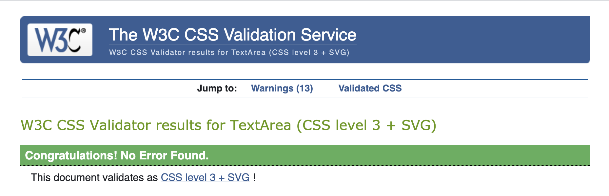

:open_file_folder: Table of Contents
======

**

Manual testing
**
* [**_User stories_**](#user-stories)

**

Code check
**
* [**_HTML_**](#html)
* [**_CSS_**](#css)
* [**_JavaScript_**](#javascript)
* [**_Python_**](#python)
* [**_Lighthouse_**](#lighthouse)
* [**_GTmetrix_**](#gtmetrix)
* [**_Color blindness_**](#color-blindness)
* [**_Other tests_**](#other-tests)

**

Bugs
**
* [**_Background_**](#background)
* [**_Mobile nav_**](#mobile-nav)
* [**_Flash messages_**](#flash-messages)
* [**_Logo in sidenav_**](#logo-in-sidenav)

<a href="#top">🔝</a>

:construction_worker_woman: :construction_worker_man: Manual testing
======

### User stories

<!-- The design goal is to make a clear, accessible, structured site so that visitors can easily design their own business cards.  
When landing on the page there is an explanation on how things work:  
 
  
After reading it the user can either request a sample kit or start designing. When the user clicks the sample kit button they will be taken to a form, this form needs to be filled in to get the address to send the sample kit.  

   
After everything is filled out an email is sent to, in this case me, with the data needed to send the sample kit through mail.  
  
When the user feels ready to start designing they can click the start design button, which will take them to the creator.html page.  
  
As a visitor there were multiple steps you would like to take, in the manual tests it was checked if these were achieved.
- Choose out of three different sizes of business cards.
- Choose a background color.  
This can be done in step 1 and 2. 
  
- Choose the paper type.
- Choose the quantity.  
This can be done in step 3 and 4. 
  
- Upload an own photo or logo.
- Edit text content.
- Download the designed card as a low-res jpeg file.  

  
  
The user can click the buttons to achieve this, also the selections made with steps 1 and 2 are visible on this preview. 
- Send a request for a quotation for the designed business cards. 

  
  
  
As with the sample kit form after everything is filled out the send button can be clicked and the user will be informed the request is send successfully and will be redirected to the homepage and the email with the values that are needed to make a quotation is send through EmailJS, to in this case me.

It can be concluded that all goals have been achieved.  
 
The project has been tested on the available DevTools for phone and tablet sizes as well as on multiple responsive sizes and it was made sure that it looks good and works well on all. It was also tested on multiple devices among others an OnePlus Nord, an iMac (Retina 5K, 27-inch, 2017), a MacBook-Air (Retina M1, 13.3-inch, 2020) and a Samsung Galaxy Tab4 (10.1-inch 2014), everything works as it should. -->

<a href="#top">🔝</a>

======
### HTML

HTML code was tested with a [HTML](https://validator.w3.org/nu/?doc=http%3A%2F%2Fmamamaki.herokuapp.com%2F) validator.  
  
No errors or warnings were found.

<a href="#top">🔝</a>

======

### CSS

CSS code was tested with a [CSS](https://jigsaw.w3.org/css-validator/validator.html.en#validate_by_input) validator.  
   

Only warnings were found, but nothing that needs to be fixed or effects the code in a wrong way.

<a href="#top">🔝</a>

 JavaScript
======

JavaScript was tested with a [JavaScript](https://jshint.com/) linter.  

 

Only warnings were found, but nothing that needs to be fixed or effects the code in a wrong way.

<a href="#top">🔝</a>

======

### Python

Python was tested with a [PEP8](http://pep8online.com/) linter.  
 
No errors or warnings were found.

<a href="#top">🔝</a>

:traffic_light: Lighthouse
======

### Lighthouse

<!-- All pages have passed through Lighthouse in Chrome DevTools, the results for desktop can found here:  
 
and these are the results for the mobile versions: 
 
After doing the Lighthouse checks one warning became visible, namely:  
 
This was not there in previous testing and is likely due to changes to Google's privacy policy, tutor assistance has been contacted and this warning can be ignored.
The results of the Lighthouse tests are satisfactory, so no adjustments are needed at this time. -->

<a href="#top">🔝</a>

:bar_chart: GTmetrix
====== 

### GTmetrix

<!-- The site was tested with [GTmetrix](https://gtmetrix.com/). The reports can be found here:   
[Homepage](https://gtmetrix.com/reports/daph1986.github.io/1OKsvoY3/)  
[Sample kit form](https://gtmetrix.com/reports/daph1986.github.io/iiv3HDsB/)  
[Creator page](https://gtmetrix.com/reports/daph1986.github.io/nJoX5M9e/) -->

<a href="#top">🔝</a>

:eyeglasses: Color blindness
======

### Color blindness

<!-- Color blindness was tested on this [site](https://www.toptal.com/designers/colorfilter/) to ensure you would still be able to read the website when you have different types of color blindness. Here you will find screenshots off the homepage tests, but of course all pages were tested.  

 -->

<a href="#top">🔝</a>

:test_tube: Other tests
======

### Other tests

<!-- A lot of different people were asked to check the project to ensure it works on different systems and devices. The website was tested on Samsung Galaxy TabA (10.1-inch 2019), OnePlus 5, Xiaomi Redmi Note 7, Xiaomi Redmi Note 8 Pro, Motorola G9, Motorola G5 and iPhone 12 Pro Max among others. It has been tested on the following browsers: Google Chrome, Safari, Microsoft Edge and Mozilla Firefox. One bug was found and fixed, please see Bugs section for the found text bug.

#### Advices given after testing which were followed

1. Some spelling and grammar changes have been made after reviews from my husband, brother-in-law and sister-in-law.
2. My husband, Django, did not think the user-friendliness was good enough, because only the logo could be used to return to the homepage. That is why on the page for requesting the sample kit and for designing the business card, 2 buttons have been added at the top to switch between the other pages. Cancel buttons have also been added to the bottom of the forms. This increases user-friendliness. -->

<a href="#top">🔝</a>

:bug: Bugs
======

The bugs are listed below, with a link to the issue item where they are further explained. I was able to solve all of them.

### Background
[Full size background bug](https://github.com/Daph1986/mamamaki/issues/26)

### Mobile nav
[Mobile navigation bug](https://github.com/Daph1986/mamamaki/issues/27)

### Flash messages
[Flash messages bug](https://github.com/Daph1986/mamamaki/issues/28)

### Logo in sidenav
[The sidenav logo bug](https://github.com/Daph1986/mamamaki/issues/29)

<a href="#top">🔝</a>

