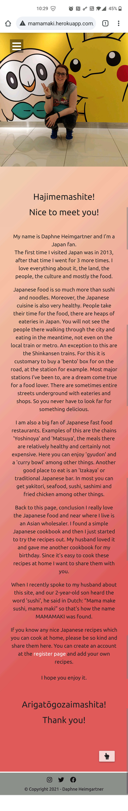
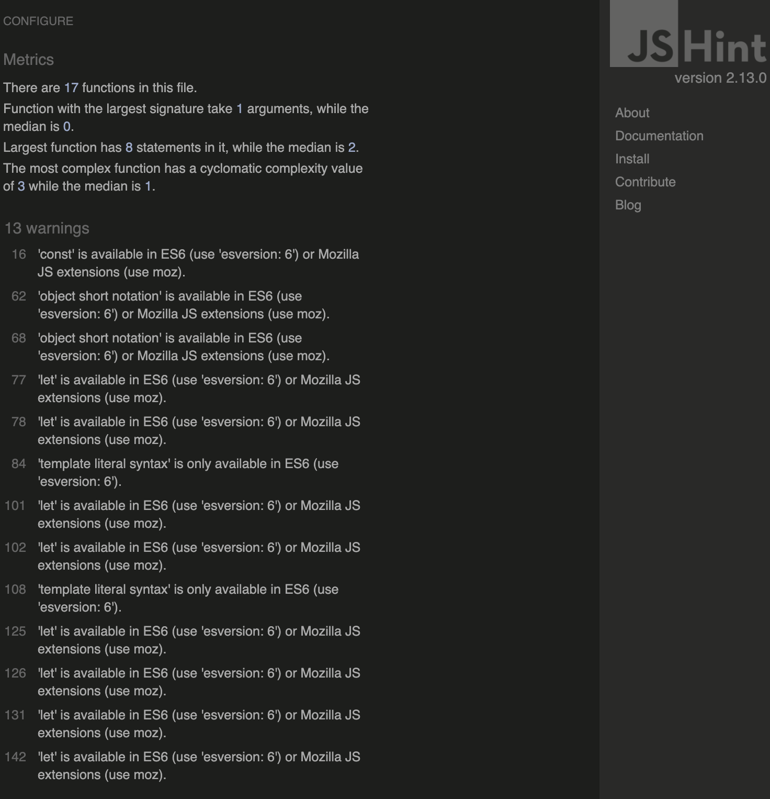
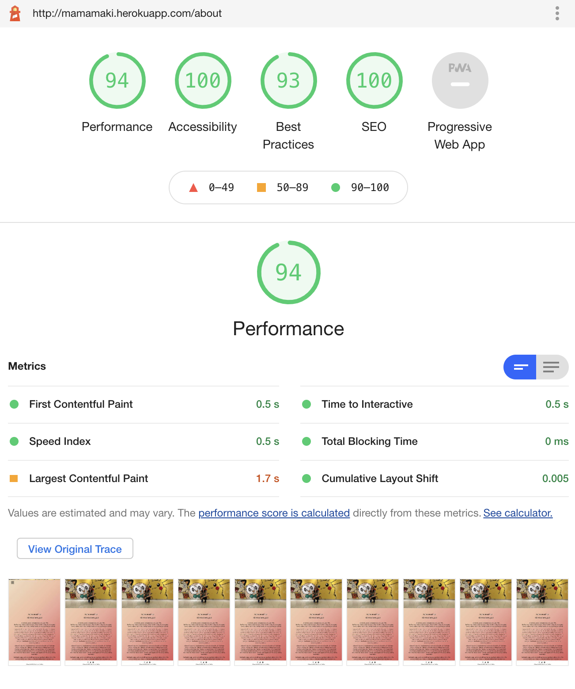
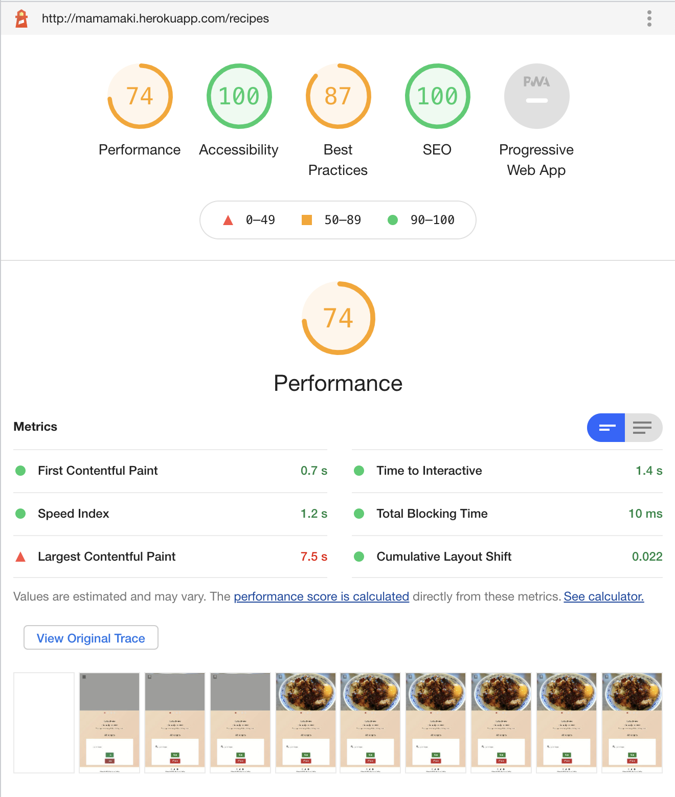
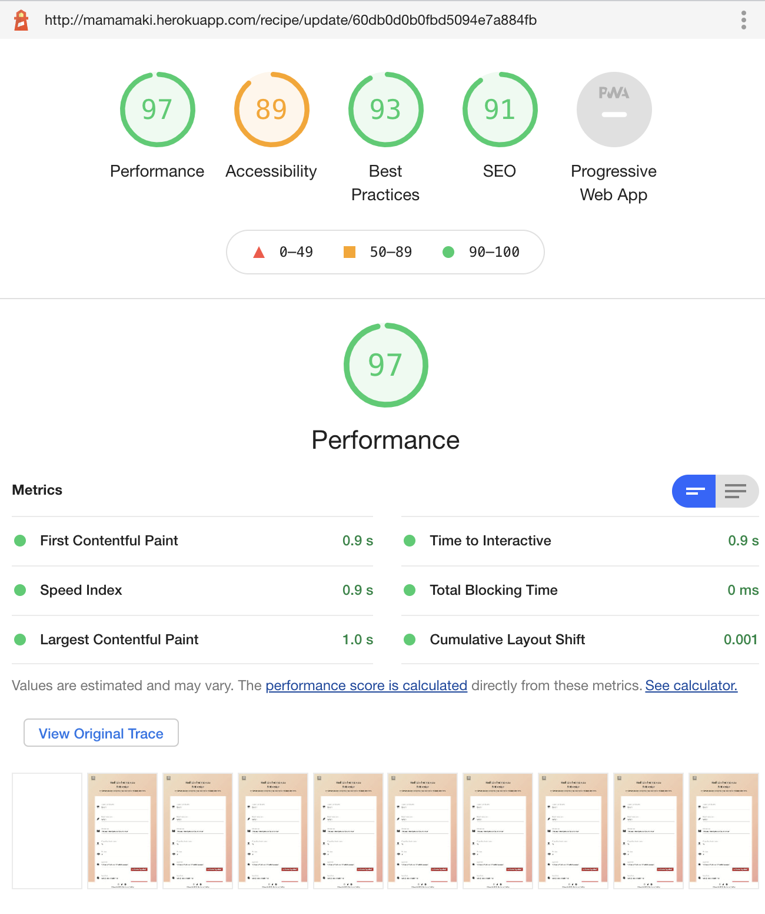

:open_file_folder: Table of Contents
======

**

Manual testing
**
* [**_User stories_**](#user-stories)

**

Code check
**
* [**_HTML_**](#html)
* [**_CSS_**](#css)
* [**_JavaScript_**](#javascript)
* [**_Python_**](#python)
* [**_Lighthouse_**](#lighthouse)
* [**_GTmetrix_**](#gtmetrix)
* [**_Color blindness_**](#color-blindness)
* [**_Other tests_**](#other-tests)

**

Bugs
**
* [**_Background_**](#background)
* [**_Mobile nav_**](#mobile-nav)
* [**_Flash messages_**](#flash-messages)
* [**_Logo in sidenav_**](#logo-in-sidenav)
* [**_Safari button bug_**](#safari-button-bug)
* [**_Multiple cards in one card bug_**](#multiple-cards-in-one-card-bug)

<a href="#top">🔝</a>

:construction_worker_woman: :construction_worker_man: Manual testing
======

### User stories

The design goal is to make a clear, accessible, structured site so that visitors can easily read the displayed recipes, make an account and add, edit and delete their own recipes.  
To test the goals screen records of an OnePlus Nord were made. 
NOTE: the grey overlay in some caption on the footer are displayed because the end of the screen was captured, when just looking on the device this is not visible. So this is just the screen records issue of the phone not a site issue!!!  
On small devices the menu can be accesed through the hamburger menu, on large devices the sidenav is always visible. There is a difference between the menu for an user who is not logged in and an user who is logged in. 
 

#### The visitor goals are:
- To be able to see different recipes and search for them using keywords. 
When you navigate to `recipes` you will see a search option and a list with recipe cards.  
   
In the example underneath, the `search` keyword used is pork and the results for the search will be displayed, in this case two recipes. 

 

<a href="#top">🔝</a>

- To create an account and log in on that account. 
To register navigate to `Register` in the menu. 

 
Fill in an `Username` and `Password` end hit `Register`. If the is a not yet excisting user it will successfully register the account 
  
If the username is already used it will give an error message. When the characters used are not in range of what is required it will also give error messages, however since I used a phone with langues set to Dutch as a primary language this will be displayed in Dutch. 

   
The same will aply when you navigat to `Log in` and try to log in with an excisting account. It will log you in or give an error message if the username and / or password is not correct: 
   
Alternatively you can navigate to `Register` and `Log in` through the `Home` page: 
 
Or navigate to `Register` through the `About` page: 

<a href="#top">🔝</a>

- To create, read, update and delete my own recipes. 
To create a recipe, make sure you are logged in, if not, navigate to `Log in` and log in to your account. If you don't have an account, navigate to `Register` and register an account. Once logged in navigate to `Add recipe`, there you can fill out the form. 
 
Fill out the form and hit  `Add recipe`. 
  
To read the recipe navigate to `Recipes` in the menu, pick a recipe and hit `Go to recipe`, there you'll see the full recipe. 
  
To edit / update the recipe hit  `Edit recipe` 
 
and change what you want to edit in the recipe, then hit  `Save edited recipe` 
  
To delete a recipe hit `Delete recipe`, you will see a message with the question if you are sure you want to delete it. 
 
If you are sure hit `YES,DELETE!` and the recipe will be deleted. 
 

<a href="#top">🔝</a>

#### The site owners goals are:

- To share the love for Japanese home cooking and promote it. 
The love for Japanese home cooking is explained on the about page, to read it navigate to `About`.

<a href="#top">🔝</a>

- Share nice Japanese home cooking recipes. 
This is shown through the recipes page were all the shared recipes can be found. Navigate to `Recipes` to read them. 
    

It can be concluded that all goals have been achieved.  

The project has been tested on the available DevTools for phone and tablet sizes as well as on multiple responsive sizes and it was made sure that it looks good and works well on all. It was also tested on multiple devices among others an OnePlus Nord, an iMac (Retina 5K, 27-inch, 2017), a MacBook-Air (Retina M1, 13.3-inch, 2020) and a Samsung Galaxy Tab4 (10.1-inch 2014), everything works as it should.

<a href="#top">🔝</a>

======
### HTML

The HTML code of all pages was tested with a [HTML](https://validator.w3.org/nu/?doc=http%3A%2F%2Fmamamaki.herokuapp.com%2F) validator. 
  
  
  
  
  
  
  
  
No errors or warnings were found. 

<a href="#top">🔝</a>

======

### CSS

The CSS code was tested with a [CSS](https://jigsaw.w3.org/css-validator/validator.html.en#validate_by_input) validator.  
   

Only warnings were found, but nothing that needs to be fixed or effects the code in a wrong way.

<a href="#top">🔝</a>

======

### JavaScript

The JavaScript code was tested with a [JavaScript](https://jshint.com/) linter.  

 

Only warnings were found, but nothing that needs to be fixed or effects the code in a wrong way.

<a href="#top">🔝</a>

======

### Python

The Python code was tested with a [PEP8](http://pep8online.com/) linter.  
 
No errors or warnings were found.

<a href="#top">🔝</a>

:traffic_light: Lighthouse
======

### Lighthouse

All pages have passed through Lighthouse in Chrome DevTools, the results for desktop can found here:  
        
and these are the results for the mobile versions: 
        
The results of the Lighthouse tests are satisfactory, so no adjustments are needed at this time. But in the future a way to increase the performance on some pages would be something to do in an update.

<a href="#top">🔝</a>

:bar_chart: GTmetrix
====== 

### GTmetrix

The site was tested with [GTmetrix](https://gtmetrix.com/). The reports can be found here: 
[Homepage](https://gtmetrix.com/reports/mamamaki.herokuapp.com/s5oaEEkc/)  
[About page](https://gtmetrix.com/reports/mamamaki.herokuapp.com/ORtp6cCU/)  
[Recipes page](https://gtmetrix.com/reports/mamamaki.herokuapp.com/jJydxJtH/)  
[Single recipe page](https://gtmetrix.com/reports/mamamaki.herokuapp.com/bZ5vU616/)  
[Register page](https://gtmetrix.com/reports/mamamaki.herokuapp.com/D9zcldQf/)  
[Log in page](https://gtmetrix.com/reports/mamamaki.herokuapp.com/w7caPZIA/)  
[Personal recipe page](https://gtmetrix.com/reports/mamamaki.herokuapp.com/ilAC1S1D/)  
[Add recipe](https://gtmetrix.com/reports/mamamaki.herokuapp.com/N1BFTHGb/)  
[Edit recipe](https://gtmetrix.com/reports/mamamaki.herokuapp.com/UMcBCkEe/)  

<a href="#top">🔝</a>

:eyeglasses: Color blindness
======

### Color blindness

Color blindness was tested on this [site](https://www.toptal.com/designers/colorfilter/) to ensure you would still be able to read the website when you have different types of color blindness. Here you will find the links of the homepage tests, but of course all pages were tested.  
[Protanopia](https://www.toptal.com/designers/colorfilter?orig_uri=http://mamamaki.herokuapp.com/&process_type=protan)  
[Deutanopia](https://www.toptal.com/designers/colorfilter?orig_uri=http://mamamaki.herokuapp.com/&process_type=deutan)  
[Tritanopia](https://www.toptal.com/designers/colorfilter?orig_uri=http://mamamaki.herokuapp.com/&process_type=tritan)  
[Greyscale / Achromatopsia](https://www.toptal.com/designers/colorfilter?orig_uri=http://mamamaki.herokuapp.com/&process_type=grey)

<a href="#top">🔝</a>

:test_tube: Other tests
======

### Other tests

A lot of different people were asked to check the project to ensure it works on different systems and devices. The website was tested on Samsung Galaxy TabA (10.1-inch 2019), OnePlus 5, Xiaomi Redmi Note 7, Xiaomi Redmi Note 8 Pro, Motorola G9, Motorola G5 and iPhone 12 Pro Max among others. It has been tested on the following browsers: Google Chrome, Safari, Microsoft Edge and Mozilla Firefox. During the testing two bugs were found and fixed, the Safari button bug and the Multiple cards in one card bug, please see the Bugs section and matching issue link for these bugs and their fix.
 
The contact form of the home page has also been tested on Google Chrome, Safari, Microsoft Edge and Mozilla Firefox, this works as it should. 

<!-- #### Advices given after testing which were followed

1. Some spelling and grammar changes have been made after reviews from my husband, brother-in-law and sister-in-law.
2. My husband, Django, did not think the user-friendliness was good enough, because only the logo could be used to return to the homepage. That is why on the page for requesting the sample kit and for designing the business card, 2 buttons have been added at the top to switch between the other pages. Cancel buttons have also been added to the bottom of the forms. This increases user-friendliness. -->

<a href="#top">🔝</a>

:bug: Bugs
======

The bugs are listed below, with a link to the issue item where they are further explained. I was able to solve all of them.

### Background
[Full size background bug](https://github.com/Daph1986/mamamaki/issues/26)

### Mobile nav
[Mobile navigation bug](https://github.com/Daph1986/mamamaki/issues/27)

### Flash messages
[Flash messages bug](https://github.com/Daph1986/mamamaki/issues/28)

### Logo in sidenav
[The sidenav logo bug](https://github.com/Daph1986/mamamaki/issues/29)

### Safari button bug
[Safari button bug](https://github.com/Daph1986/mamamaki/issues/30)

### Multiple cards in one card bug
[Multiple cards in one card bug](https://github.com/Daph1986/mamamaki/issues/31)

<a href="#top">🔝</a>

